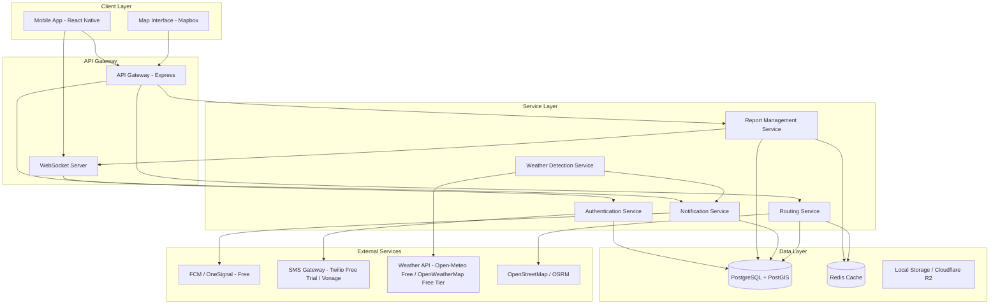

# Technical Design Document

## Overview

The Waterlogging Alert Platform is a real-time crowdsourced mapping system that helps residents and travelers in Ahmedabad, Gujarat navigate safely during monsoon season. The platform combines weather detection, user-generated reports, and intelligent routing to provide up-to-date information about waterlogged areas.

### Core Capabilities

- Real-time rain detection and proactive user notification
- Crowdsourced waterlogging reports with severity classification
- Interactive map visualization with color-coded severity indicators
- Intelligent route planning that avoids waterlogged areas
- Report aggregation and automatic expiry for data freshness
- Multi-language support (English, Hindi, Gujarati)
- Offline functionality with data caching

### Technical Approach

The system follows a mobile-first architecture with a React Native frontend, Node.js backend, and PostgreSQL/PostGIS database for geospatial queries. Real-time updates are handled via WebSocket connections, and push notifications are delivered through Firebase Cloud Messaging. The routing engine integrates with OpenStreetMap data and applies custom cost functions to avoid waterlogged areas.

## Architecture

### System Components



### Deployment Architecture

- **Mobile Application**: React Native app deployed to iOS App Store and Google Play Store
- **Backend Services**: Containerized Node.js services deployed on self-hosted server or free-tier platforms (Railway, Render, Fly.io)
- **Database**: Self-hosted PostgreSQL with PostGIS extension or free-tier managed PostgreSQL (Supabase, Neon)
- **Cache**: Self-hosted Redis or free-tier Redis (Upstash, Redis Cloud free tier)
- **Static Assets**: Self-hosted or free CDN alternatives (Cloudflare Pages, Vercel)
- **Load Balancer**: Nginx reverse proxy for traffic distribution

### Data Flow

1. **Report Submission Flow**:
   - User submits report → API Gateway validates → Report Service creates record → PostGIS calculates affected area → WebSocket broadcasts update → Map Interface refreshes

2. **Rain Detection Flow**:
   - Weather Service polls API → Detects rainfall → Queries users in affected areas → Notification Service sends FCM push → Users respond → Report Service processes responses

3. **Route Planning Flow**:
   - User enters destination → Routing Service queries active waterlogging areas → Applies cost function to OSM graph → Calculates optimal path → Returns route with warnings

## Components and Interfaces

### Mobile Application (React Native)

**Responsibilities**:
- User interface for map visualization and report submission
- Location tracking and permission management
- Offline data caching and queue management
- Push notification handling

**Key Modules**:
- `MapScreen`: Displays waterlogged areas with color-coded markers
- `ReportSubmission`: Handles manual and notification-triggered reports
- `Navigation`: Route planning and turn-by-turn navigation
- `AuthFlow`: Registration and phone verification
- `OfflineManager`: Caches map data and queues reports

**External Dependencies**:
- Mapbox SDK for map rendering (free tier available) or Leaflet with OpenStreetMap tiles (completely free)
- React Native Geolocation for GPS tracking
- React Native Push Notification for FCM/OneSignal integration
- AsyncStorage for offline data persistence

### API Gateway (Express.js)

**Responsibilities**:
- Request routing and load balancing
- Authentication token validation
- Rate limiting and request throttling
- API versioning

**Endpoints**:
```
POST   /api/v1/auth/register
POST   /api/v1/auth/verify
POST   /api/v1/reports
GET    /api/v1/reports/area?lat={lat}&lng={lng}&radius={radius}
POST   /api/v1/routes/calculate
GET    /api/v1/map/areas
PUT    /api/v1/users/settings
```

### Report Management Service

**Responsibilities**:
- Create and validate waterlogging reports
- Calculate affected areas using geospatial queries
- Aggregate reports and determine severity levels
- Expire outdated reports
- Handle "no waterlogging" reports

**Key Functions**:
- `createReport(userId, location, severity)`: Creates new waterlogging report
- `aggregateReports(area)`: Calculates aggregate severity for an area
- `expireReports()`: Background job to remove expired reports
- `clearArea(userId, location)`: Marks area as clear
- `getActiveReports(bounds)`: Returns reports within map bounds

**Database Schema**:
```sql
CREATE TABLE waterlogging_reports (
    id UUID PRIMARY KEY,
    user_id UUID REFERENCES users(id),
    location GEOGRAPHY(POINT, 4326),
    severity VARCHAR(10) CHECK (severity IN ('Low', 'Medium', 'High')),
    report_type VARCHAR(20) CHECK (report_type IN ('waterlogged', 'clear')),
    created_at TIMESTAMP DEFAULT NOW(),
    expires_at TIMESTAMP,
    is_active BOOLEAN DEFAULT TRUE
);

CREATE INDEX idx_reports_location ON waterlogging_reports USING GIST(location);
CREATE INDEX idx_reports_active ON waterlogging_reports(is_active, expires_at);
```

### Notification Service

**Responsibilities**:
- Send rain detection notifications
- Send navigation alerts
- Manage notification frequency limits
- Handle user responses to notifications

**Key Functions**:
- `sendRainNotification(userIds)`: Sends rain detection push notifications
- `sendNavigationAlert(userId, area, distance)`: Alerts user about waterlogging on route
- `canSendNotification(userId, type)`: Checks notification frequency limits
- `processNotificationResponse(userId, response)`: Handles user responses

**Push Notification Payload Structure** (FCM or OneSignal):
```json
{
  "notification": {
    "title": "Rain Detected",
    "body": "Is there rain in your area?"
  },
  "data": {
    "type": "rain_detection",
    "notification_id": "uuid",
    "timestamp": "ISO8601"
  }
}
```

### Routing Service

**Responsibilities**:
- Calculate routes avoiding waterlogged areas
- Apply severity-based cost functions
- Recalculate routes when new reports affect path
- Generate proximity warnings

**Key Functions**:
- `calculateRoute(origin, destination, avoidAreas)`: Computes optimal route
- `applyCostFunction(edge, waterloggedAreas)`: Adjusts edge weights based on waterlogging
- `checkRouteProximity(route, waterloggedAreas)`: Identifies warnings
- `recalculateIfNeeded(activeRoute, newReport)`: Triggers route updates

**Cost Function**:
```
edge_cost = base_distance * severity_multiplier
where:
  severity_multiplier = 1.0 (no waterlogging)
                      = 5.0 (Low severity)
                      = 20.0 (Medium severity)
                      = 1000.0 (High severity - effectively blocked)
```

### Weather Detection Service

**Responsibilities**:
- Poll weather API for rainfall data
- Identify affected geographic areas
- Trigger rain notifications
- Maintain weather event history

**Key Functions**:
- `pollWeatherData()`: Scheduled job every 5 minutes
- `detectRainfall(weatherData)`: Identifies rainfall events
- `getAffectedUsers(rainfallArea)`: Queries users in affected areas
- `triggerNotifications(userIds)`: Initiates notification flow

**Weather API Integration**:
- Provider: OpenWeatherMap API (free tier: 1000 calls/day) or Open-Meteo (completely free, no API key required)
- Polling interval: 5 minutes
- Data points: Precipitation, location, timestamp

### Authentication Service

**Responsibilities**:
- User registration and phone verification
- JWT token generation and validation
- Session management
- Rate limiting enforcement

**Key Functions**:
- `registerUser(phoneNumber)`: Creates user account and sends verification code
- `verifyPhone(userId, code)`: Validates verification code
- `generateToken(userId)`: Creates JWT access token
- `validateToken(token)`: Verifies token authenticity
- `checkReportLimit(userId)`: Enforces daily report limit

**User Schema**:
```sql
CREATE TABLE users (
    id UUID PRIMARY KEY,
    phone_number VARCHAR(15) UNIQUE NOT NULL,
    phone_verified BOOLEAN DEFAULT FALSE,
    verification_code VARCHAR(6),
    verification_expires_at TIMESTAMP,
    language VARCHAR(10) DEFAULT 'en',
    daily_report_count INTEGER DEFAULT 0,
    last_report_date DATE,
    created_at TIMESTAMP DEFAULT NOW()
);
```

## Data Models

### Waterlogging Report

```typescript
interface WaterloggingReport {
  id: string;
  userId: string;
  location: {
    latitude: number;
    longitude: number;
    accuracy: number;
  };
  severity: 'Low' | 'Medium' | 'High';
  reportType: 'waterlogged' | 'clear';
  createdAt: Date;
  expiresAt: Date;
  isActive: boolean;
}
```

### Area Status

```typescript
interface AreaStatus {
  center: {
    latitude: number;
    longitude: number;
  };
  radius: number; // 500 meters
  aggregateSeverity: 'Low' | 'Medium' | 'High';
  reportCount: number;
  mostRecentReport: Date;
  reports: WaterloggingReport[];
}
```

### Route

```typescript
interface Route {
  id: string;
  origin: Coordinate;
  destination: Coordinate;
  waypoints: Coordinate[];
  distance: number; // meters
  estimatedDuration: number; // seconds
  warnings: RouteWarning[];
  avoidedAreas: AreaStatus[];
}

interface RouteWarning {
  location: Coordinate;
  distance: number; // meters from current position
  severity: 'Low' | 'Medium' | 'High';
  message: string;
}
```

### User

```typescript
interface User {
  id: string;
  phoneNumber: string;
  phoneVerified: boolean;
  language: 'en' | 'hi' | 'gu';
  dailyReportCount: number;
  lastReportDate: Date;
  createdAt: Date;
}
```

### Notification

```typescript
interface Notification {
  id: string;
  userId: string;
  type: 'rain_detection' | 'navigation_alert' | 'route_update';
  title: string;
  body: string;
  data: Record<string, any>;
  sentAt: Date;
  respondedAt?: Date;
  response?: any;
}
```

## Correctness Properties


*A property is a characteristic or behavior that should hold true across all valid executions of a system-essentially, a formal statement about what the system should do. Properties serve as the bridge between human-readable specifications and machine-verifiable correctness guarantees.*

### Property Reflection

After analyzing all 60 acceptance criteria, I identified several areas of redundancy:

- Properties 4.2, 4.3, 4.4 can be combined into a single property about severity-to-color mapping
- Properties 2.1, 2.2, 2.3 describe a sequential flow that can be tested as a single property about the notification response workflow
- Properties 5.2 and 5.3 both test the "maximum severity" aggregation rule and can be combined
- Properties 10.2 and 10.3 both test permission-based feature gating and can be combined
- Properties 11.2 and 11.3 both test offline status indicators and can be combined

The following properties represent the unique, non-redundant validation requirements:

### Property 1: Rain Notification Targeting and Timing

*For any* rainfall event detected in Ahmedabad, all users within the affected geographic area should receive a rain notification within 5 minutes of detection.

**Validates: Requirements 1.1**

### Property 2: Rain Notification Structure

*For any* rain notification generated by the system, the notification should contain the question "Is there rain in your area?" and provide Yes/No response options.

**Validates: Requirements 1.2**

### Property 3: Notification Interactivity

*For any* rain notification received by a user, the notification interface should allow the user to respond directly without opening the app.

**Validates: Requirements 1.3**

### Property 4: Notification Rate Limiting

*For any* user and any sequence of rainfall events, the user should receive at most one rain notification per 2-hour period.

**Validates: Requirements 1.4**

### Property 5: Notification Response Workflow

*For any* user who responds "Yes" to a rain notification, the system should present the waterlogging status question with Yes/No options, and if the user selects "Yes", should prompt for severity level selection (Low, Medium, High).

**Validates: Requirements 2.1, 2.2, 2.3**

### Property 6: Location Capture Accuracy

*For any* waterlogging report submission, the system should capture the user's GPS coordinates with accuracy within 50 meters.

**Validates: Requirements 2.4**

### Property 7: Report Creation Timing

*For any* waterlogging report submission, the system should create a complete report (with timestamp, location, and severity) within 2 seconds.

**Validates: Requirements 2.5**

### Property 8: Clear Report Processing

*For any* user who selects "No" for waterlogging, the system should create a clear report for that area and update the map interface to reflect the cleared status.

**Validates: Requirements 2.6**

### Property 9: Manual Report Workflow

*For any* user who taps the "Report Waterlogging" button, the system should prompt for severity level selection and create a waterlogging report using the user's current location.

**Validates: Requirements 3.2, 3.3**

### Property 10: Seasonal Report Restrictions

*For any* date outside the rainy season (June-September), manual waterlogging report submissions should be rejected.

**Validates: Requirements 3.4**

### Property 11: Map Completeness

*For any* set of active waterlogging reports, all corresponding areas should be displayed on the map interface.

**Validates: Requirements 4.1**

### Property 12: Severity Color Mapping

*For any* area displayed on the map, the area marker color should correspond to its severity level: yellow for Low, orange for Medium, and red for High.

**Validates: Requirements 4.2, 4.3, 4.4**

### Property 13: Area Detail Display

*For any* marked area on the map, tapping the area should display the severity level, number of contributing reports, and the timestamp of the most recent report.

**Validates: Requirements 4.5**

### Property 14: Real-Time Map Updates

*For any* new waterlogging report submitted, the map interface should update to reflect the new report within 10 seconds.

**Validates: Requirements 4.6**

### Property 15: Report Aggregation

*For any* area with multiple waterlogging reports within a 1-hour period, the system should calculate an aggregate severity level.

**Validates: Requirements 5.1**

### Property 16: Maximum Severity Aggregation

*For any* area with 2 or more waterlogging reports, the aggregate severity should be the highest severity level among all reports.

**Validates: Requirements 5.2, 5.3**

### Property 17: Report Count Display

*For any* area displayed on the map, the number of reports contributing to that area's status should be visible.

**Validates: Requirements 5.4**

### Property 18: Report Expiry

*For any* waterlogging report that reaches 4 hours of age, the system should mark the report as inactive.

**Validates: Requirements 6.1**

### Property 19: Area Removal After Expiry

*For any* area where all waterlogging reports have expired, the system should remove the area marking from the map within 5 minutes.

**Validates: Requirements 6.2**

### Property 20: Report Age Display

*For any* area displayed on the map, the age of the most recent report should be shown (e.g., "Updated 45 minutes ago").

**Validates: Requirements 6.3**

### Property 21: Clear Report Expiry Effect

*For any* clear report submitted for an area, all active waterlogged reports in that area should be immediately marked as expired.

**Validates: Requirements 6.4**

### Property 22: Route Avoidance

*For any* origin and destination pair, the calculated route should avoid all areas marked as waterlogged when possible.

**Validates: Requirements 7.1**

### Property 23: Exposure Minimization

*For any* origin and destination pair where complete avoidance of waterlogged areas is impossible, the calculated route should minimize the total distance traveled through waterlogged areas.

**Validates: Requirements 7.2**

### Property 24: Severity-Based Route Prioritization

*For any* route calculation involving multiple waterlogged areas with different severity levels, the route should prioritize avoiding High severity areas over Medium and Low severity areas.

**Validates: Requirements 7.3**

### Property 25: Proximity Warnings

*For any* calculated route that passes within 200 meters of a waterlogged area, the system should display a warning to the user.

**Validates: Requirements 7.4**

### Property 26: Dynamic Route Recalculation

*For any* active navigation route, when a new waterlogging report affects the route, the system should recalculate the route within 15 seconds.

**Validates: Requirements 7.5**

### Property 27: Location Tracking Frequency

*For any* active navigation session, the system should update the user's location every 30 seconds.

**Validates: Requirements 8.1**

### Property 28: Proximity Alert Triggering

*For any* user navigating and approaching within 500 meters of a waterlogged area, the system should send an alert notification.

**Validates: Requirements 8.2**

### Property 29: Alert Content Completeness

*For any* proximity alert notification, the notification should include the severity level and estimated distance to the waterlogged area.

**Validates: Requirements 8.3**

### Property 30: Route-Based Notifications

*For any* new waterlogging report created on a user's active navigation route, the system should notify the user within 20 seconds.

**Validates: Requirements 8.4**

### Property 31: Phone Number Registration Requirement

*For any* user registration attempt, the system should require a valid mobile phone number.

**Validates: Requirements 9.1**

### Property 32: Verification Code Delivery

*For any* user registration, the system should send a verification code via SMS.

**Validates: Requirements 9.2**

### Property 33: Verification Requirement for Reports

*For any* waterlogging report submission attempt, the system should only allow the submission if the user's phone number has been verified.

**Validates: Requirements 9.3**

### Property 34: Daily Report Limit

*For any* user and any 24-hour period, the system should allow at most 10 waterlogging report submissions.

**Validates: Requirements 9.4**

### Property 35: Limit Exceeded Message

*For any* user who attempts to submit a report after reaching the daily limit, the system should display the message "Daily report limit reached".

**Validates: Requirements 9.5**

### Property 36: Permission-Based Feature Gating

*For any* user who has denied location permission, the system should operate in view-only mode with report submission features disabled.

**Validates: Requirements 10.2, 10.3**

### Property 37: Report Anonymization

*For any* waterlogging report stored in the system, the report should not contain personally identifiable information that could identify the submitting user.

**Validates: Requirements 10.5**

### Property 38: Offline Cache Display

*For any* loss of network connectivity, the system should display the most recently cached map data.

**Validates: Requirements 11.1**

### Property 39: Offline Status Indicators

*For any* offline state, the map interface should display both a cache indicator and the timestamp of the last successful data sync.

**Validates: Requirements 11.2, 11.3**

### Property 40: Reconnection Sync Timing

*For any* restoration of network connectivity, the system should sync cached data with the server within 10 seconds.

**Validates: Requirements 11.4**

### Property 41: Offline Report Queuing

*For any* waterlogging report submitted while offline, the system should queue the report and transmit it when connectivity is restored.

**Validates: Requirements 11.5**

### Property 42: Language Detection

*For any* first launch of the application, the system should detect the device language and set it as the default platform language (if supported).

**Validates: Requirements 12.2**

### Property 43: Language Switch Timing

*For any* user language change, the system should update all interface text within 2 seconds.

**Validates: Requirements 12.4**

### Property 44: Notification Localization

*For any* notification sent to a user, the notification text should be in the user's selected language.

**Validates: Requirements 12.5**

## Error Handling

### Client-Side Error Handling

**Location Services Errors**:
- GPS unavailable: Display message "Location services unavailable. Please enable GPS to submit reports."
- Low accuracy: Display warning "Location accuracy is low. Report may be less precise."
- Permission denied: Redirect to view-only mode with explanation

**Network Errors**:
- Connection timeout: Retry with exponential backoff (1s, 2s, 4s, 8s)
- Server unavailable: Display "Service temporarily unavailable. Your report will be queued."
- Offline mode: Queue reports and display offline indicator

**Report Submission Errors**:
- Daily limit reached: Display "Daily report limit reached" message
- Invalid location: Display "Unable to determine your location. Please try again."
- Duplicate report: Display "You've already reported this area recently."

### Server-Side Error Handling

**Database Errors**:
- Connection pool exhausted: Return 503 Service Unavailable with retry-after header
- Query timeout: Log error, return 504 Gateway Timeout
- Constraint violation: Return 400 Bad Request with specific error message

**External Service Errors**:
- Weather API unavailable: Use cached weather data, log warning
- SMS gateway failure: Retry up to 3 times, then queue for later delivery (consider free alternatives: Vonage, MessageBird, or email-to-SMS)
- Push notification failure: Log error, attempt alternative notification method

**Data Validation Errors**:
- Invalid coordinates: Return 400 with message "Invalid location coordinates"
- Invalid severity level: Return 400 with message "Severity must be Low, Medium, or High"
- Missing required fields: Return 400 with specific field errors

**Rate Limiting**:
- Too many requests: Return 429 Too Many Requests with retry-after header
- Daily limit exceeded: Return 403 Forbidden with limit information

### Error Recovery Strategies

**Graceful Degradation**:
- If routing service fails, display waterlogged areas without route calculation
- If real-time updates fail, fall back to polling every 30 seconds
- If map tiles fail to load, display list view of waterlogged areas

**Data Consistency**:
- Use database transactions for report creation and area updates
- Implement idempotency keys for report submissions to prevent duplicates
- Use optimistic locking for concurrent report aggregation

**Monitoring and Alerting**:
- Alert on error rate > 5% for any endpoint
- Alert on database connection pool > 80% utilization
- Alert on notification delivery failure rate > 10%
- Alert on average response time > 2 seconds

## Testing Strategy

### Dual Testing Approach

The testing strategy employs both unit testing and property-based testing to ensure comprehensive coverage:

- **Unit tests** verify specific examples, edge cases, and error conditions
- **Property tests** verify universal properties across all inputs
- Together they provide comprehensive coverage: unit tests catch concrete bugs while property tests verify general correctness

### Property-Based Testing

**Framework**: fast-check (JavaScript/TypeScript)

**Configuration**:
- Minimum 100 iterations per property test
- Each test tagged with format: **Feature: waterlogging-alert-platform, Property {number}: {property_text}**
- Custom generators for domain objects (coordinates, reports, areas, routes)

**Key Property Tests**:

1. **Notification Rate Limiting** (Property 4):
   - Generate random sequences of rainfall events and timestamps
   - Verify no user receives more than one notification per 2-hour window

2. **Severity Aggregation** (Property 16):
   - Generate random sets of reports for the same area
   - Verify aggregate severity equals maximum severity

3. **Route Avoidance** (Property 22):
   - Generate random origin/destination pairs and waterlogged areas
   - Verify calculated routes don't intersect waterlogged areas (when possible)

4. **Report Expiry** (Property 18):
   - Generate reports with random timestamps
   - Verify reports older than 4 hours are marked inactive

5. **Location Accuracy** (Property 6):
   - Generate random GPS coordinates with accuracy values
   - Verify captured locations meet accuracy requirements

**Custom Generators**:
```typescript
// Example generator for coordinates
const coordinateGen = fc.record({
  latitude: fc.double({ min: 22.9, max: 23.2 }), // Ahmedabad bounds
  longitude: fc.double({ min: 72.4, max: 72.8 }),
  accuracy: fc.double({ min: 5, max: 50 })
});

// Example generator for waterlogging reports
const reportGen = fc.record({
  id: fc.uuid(),
  userId: fc.uuid(),
  location: coordinateGen,
  severity: fc.constantFrom('Low', 'Medium', 'High'),
  createdAt: fc.date(),
  expiresAt: fc.date()
});
```

### Unit Testing

**Framework**: Jest with React Native Testing Library

**Coverage Requirements**:
- Minimum 80% code coverage
- 100% coverage for critical paths (report submission, route calculation)

**Key Unit Tests**:

**Report Management**:
- Test report creation with valid data
- Test report creation with missing fields (error case)
- Test report expiry after 4 hours
- Test clear report expiring waterlogged reports
- Test daily limit enforcement (10 reports per user)

**Map Visualization**:
- Test color coding for each severity level
- Test area detail display on tap
- Test map updates after new report
- Test area removal after all reports expire

**Routing**:
- Test route calculation avoiding single waterlogged area
- Test route calculation with multiple waterlogged areas
- Test route recalculation when new report affects path
- Test proximity warning generation
- Test severity-based prioritization

**Authentication**:
- Test user registration with valid phone number
- Test verification code generation and validation
- Test report submission blocked for unverified users
- Test JWT token generation and validation

**Offline Functionality**:
- Test report queuing when offline
- Test cached data display when offline
- Test sync on reconnection
- Test offline indicator display

**Localization**:
- Test language detection on first launch
- Test language switching updates all text
- Test notification localization for each language

### Integration Testing

**API Integration Tests**:
- Test complete report submission flow (auth → location → report → map update)
- Test notification flow (rain detection → notification → response → report)
- Test route calculation with live waterlogging data
- Test WebSocket real-time updates

**External Service Integration**:
- Test weather API integration with mock responses
- Test SMS gateway integration with test phone numbers (Twilio free trial or alternatives like Vonage, MessageBird)
- Test push notification delivery (FCM free or OneSignal free tier)
- Test OpenStreetMap routing integration (OSRM self-hosted or public instance)

### End-to-End Testing

**Framework**: Detox (React Native E2E testing)

**Critical User Flows**:
1. User registration and phone verification
2. Receiving rain notification and submitting report
3. Manual report submission
4. Viewing waterlogged areas on map
5. Planning route avoiding waterlogged areas
6. Receiving proximity alerts during navigation
7. Offline report submission and sync

### Performance Testing

**Load Testing**:
- Simulate 10,000 concurrent users viewing map
- Simulate 1,000 reports submitted per minute
- Test database query performance with 1M+ reports
- Test WebSocket connection handling for 5,000+ clients

**Stress Testing**:
- Test system behavior during heavy rainfall (peak usage)
- Test notification system with 50,000+ simultaneous notifications
- Test route calculation under high load

**Benchmarks**:
- Report creation: < 2 seconds (P95)
- Map data fetch: < 1 second (P95)
- Route calculation: < 3 seconds (P95)
- Real-time update delivery: < 10 seconds (P95)

### Security Testing

**Authentication Testing**:
- Test JWT token expiration and refresh
- Test rate limiting on authentication endpoints
- Test verification code brute force protection

**Authorization Testing**:
- Test report submission requires verified account
- Test daily report limit enforcement
- Test location permission enforcement

**Data Privacy Testing**:
- Verify reports don't contain user identifiers
- Verify location data is only stored for reports
- Test GDPR compliance (data export, deletion)

**Input Validation Testing**:
- Test SQL injection prevention
- Test XSS prevention in user inputs
- Test coordinate validation (within Ahmedabad bounds)
